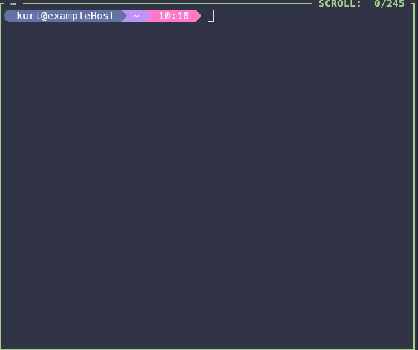

# sshtui



## Installation

### flakes + home-manager

Ajouter notre dépôt en inputs:
```
sshtui = {
  url = "github:gfriloux/sshtui";
  inputs.nixpkgs.follows = "nixpkgs";
};
```

Ensuite dans votre config `home-manager`:
```
modules = [
  sshtui.homeModules.sshtui
];

programs.sshtui.enable = true;
```

### nix profiles

```
nix profile install
```

### À la main

Installer les dépendances:

- `bash`
- `television`
- `bat`
- `gawk`
- `findutils`

Copier `sshtui` dans un dossier qui est dans vote `$PATH`.  
Copier `sshtui.toml` dans `~/.config/television/cable/`.

## Utilisation

Invoquer `sshtui` va permettre de lister vos configs
`ssh` via [tv](https://github.com/alexpasmantier/television) afin
de vous connecter aux machines déclarées.

Pour cela, vos configs doivent être dans `~/.ssh/config.d`.

### Ajouter des scripts

Par exemple, si vos configs sont dans `vaultwarden`, vous
pouvez créér `~/.config/sshtui/scripts/update`:
```bash
#!/usr/bin/env bash

rbw ls                                         \
  | grep '.ssh.conf'                           \
  | xargs -t -I {} sh -c "rbw get {} >~/.ssh/config.d/{}"

find ~/.ssh/config.d/ -maxdepth 1 -mmin +10 -type f -exec rm {} \;

exit 0
```

cela vous permettra d'invoquer `sshtui update` afin d'executer
ce scripts et avoir vos configs à jour.
